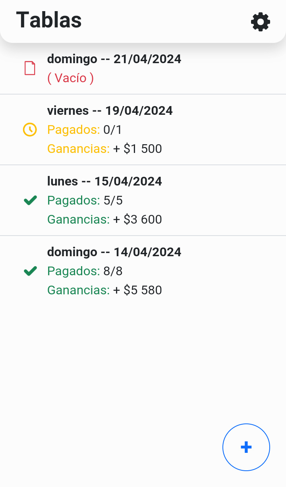
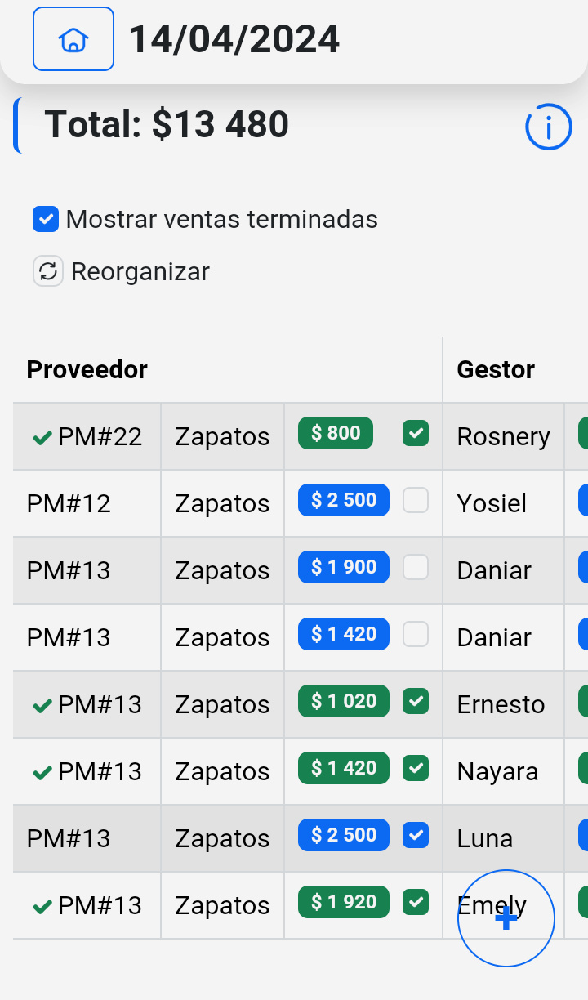
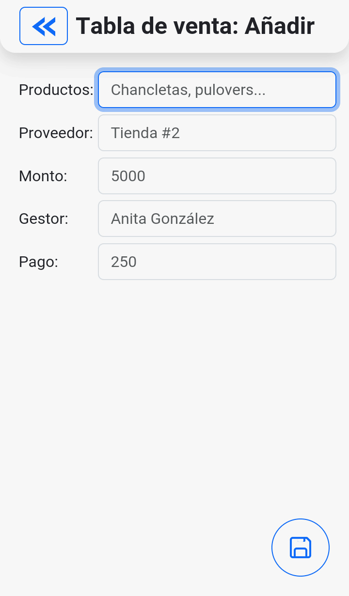
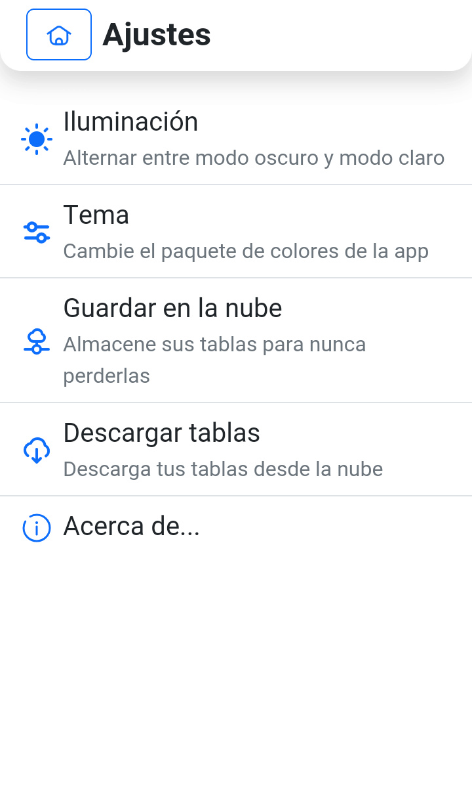
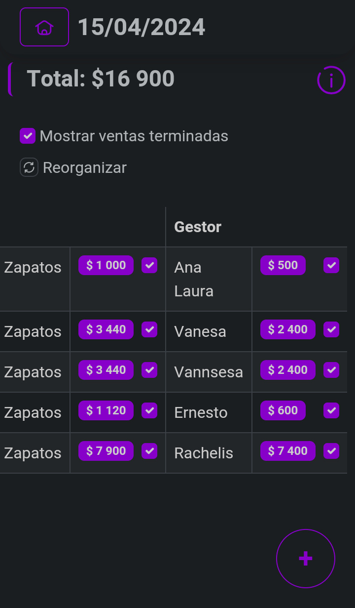
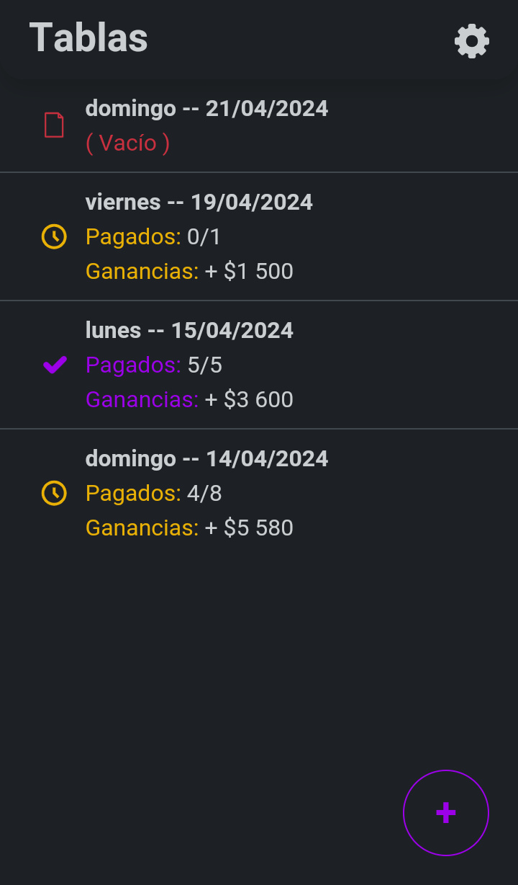

 
# 🚀 C&A - Table Management App
This a private android project tailored for C&A to streamline their sales operations.

> **Note:**  
  This repository does not contain the source code since the source is private. This repository is for informational and preview purposes only.

## 📦 Project Overview
Private project developed for our client, [C&A - Gestoría](https://github.com/CA-Gestoria). 
The application is designed to streamline the management of sales data by providing an intuitive interface for creating, modifying, and sharing sales tables.

  
  
  
  
  
  

## 🛠️ Key Features
- **Table Management:** Add and remove sales tables with ease.
- **Data Portability:** Copy tables as text for sharing via WhatsApp and export data to Excel format for reporting and analysis.
- **Flexible Record Handling:** Insert and delete rows within tables to match the required format, including product details, supplier information, amounts, salesperson names, and payments.
- **Automated Calculations:** Automatic computation of totals for amounts, payments, and resulting profits within tables.
- **Visual Customization:** Choose between light and dark modes and select from various color themes to personalize your experience.
- **Cloud Sync:** Save and synchronize your data across devices using Pantry JSON Cloud, a private cloud solution.

## 💻 Technology Stack

- **Frontend:** React
- **Project manager:** Node.js environment
- **Build Tool:** Webpack 
- **Mobile Compilation:** Droidscript for APK generation

## License
This project is proprietary and confidential. 
It is solely for use by C&A and its authorized personnel. 
Unauthorized access or distribution is strictly prohibited.

We hope this tool enhances your sales process and contributes to the success of C&A's business operations.
 